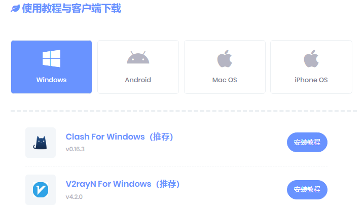
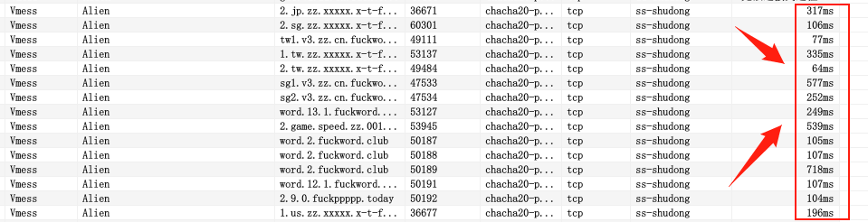
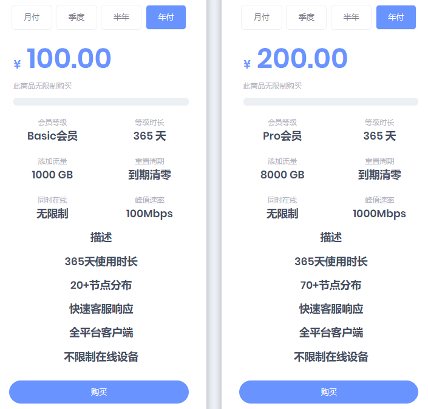

# 目前发现最好的科学上网、翻墙、梯子、vpn方法

### 注册地址：https://balala.io/auth/register?code=nAYa

优点：

1. 稳定访问chatGPT（尽量选美国节点，部分国家不支持使用）

2. 全平台（win、linux、mac、安卓、ios）

   

   

3. 支持多平台多设备同时在线使用

   

4. 节点众多且稳定、快速

   

5. 多协议选择（老司机可以根据需求选择）

   

6. 超级实惠（除了有服务器需求的，如果只是想搭梯子，是比买服务器便宜且省心，自建在现阶段封ip封端口已是常态。购买代理客户端，妥妥的智商税，各种广告、贵、流量少、不稳定、还不支持多平台等等）

   

7. 童叟无欺（支持试用，教程详细-小白福利，体验完再考虑是否入手）

### 注册地址：https://balala.io/auth/register?code=nAYa

